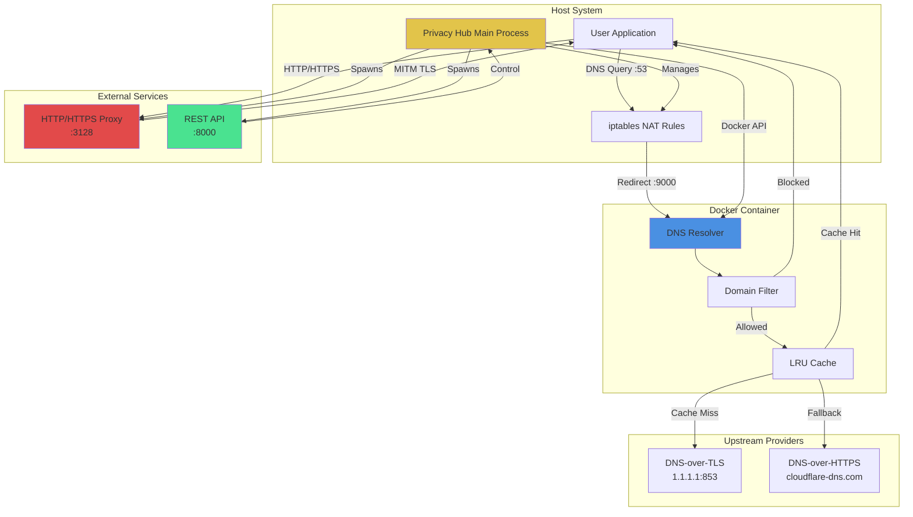
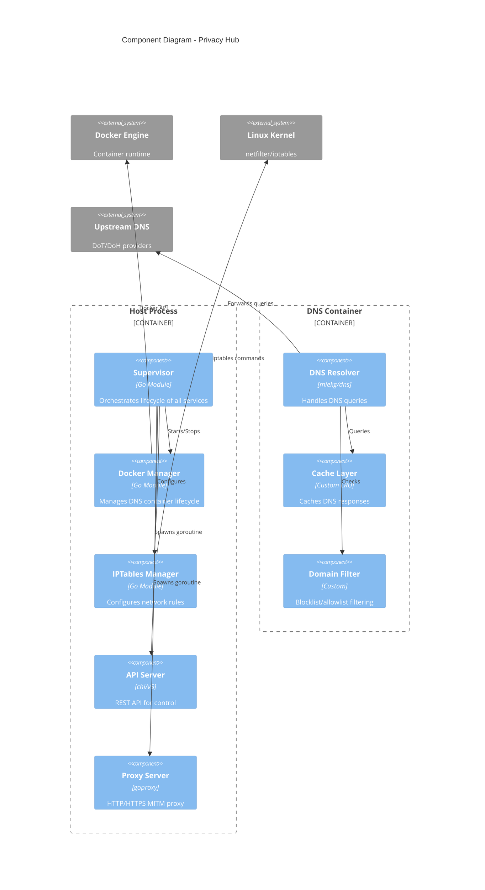
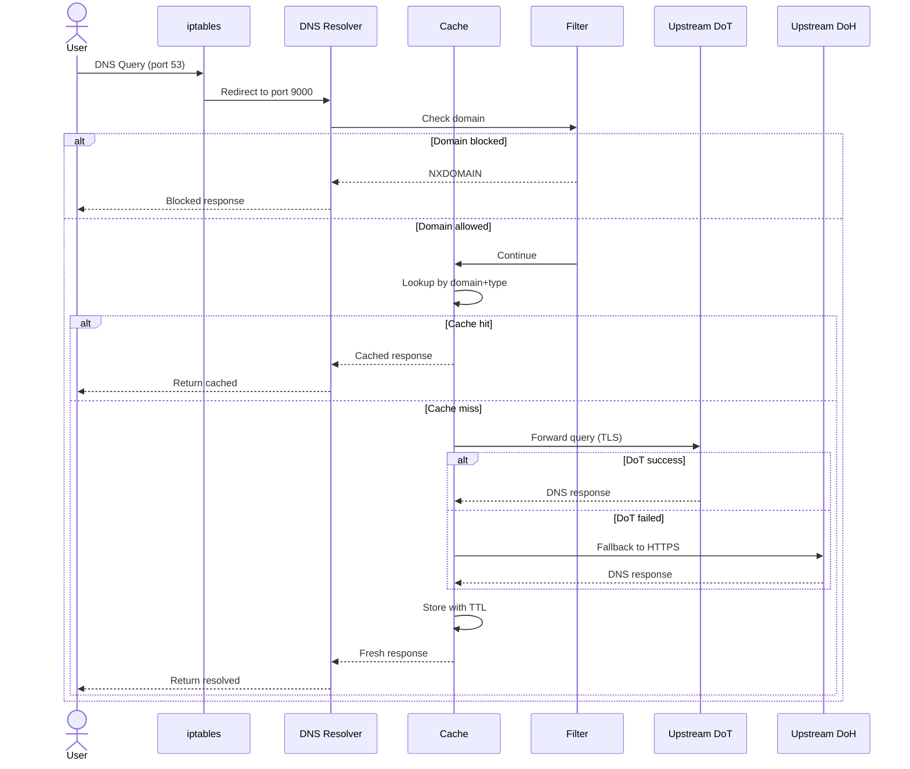
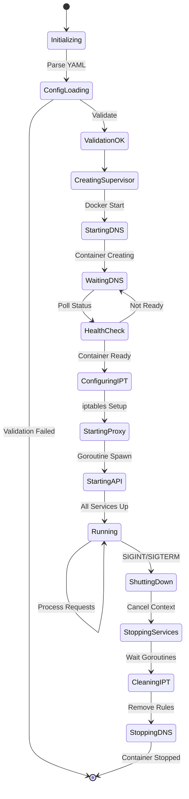
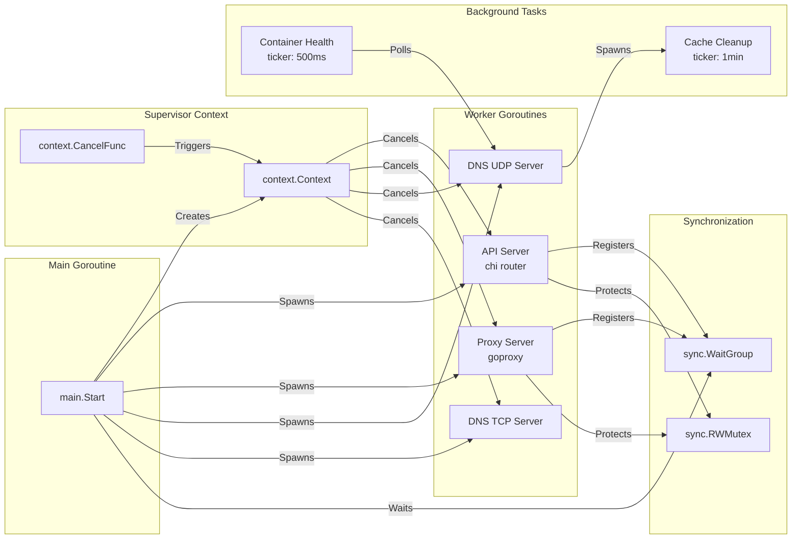
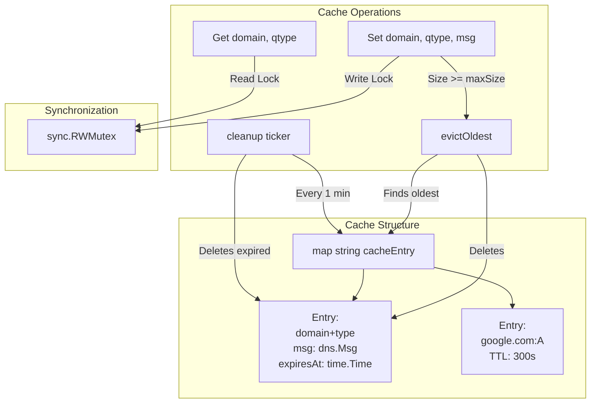
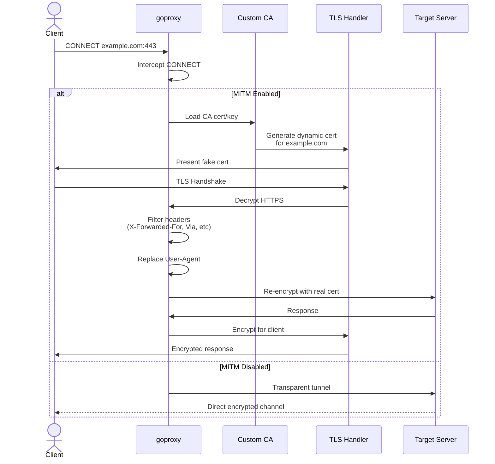
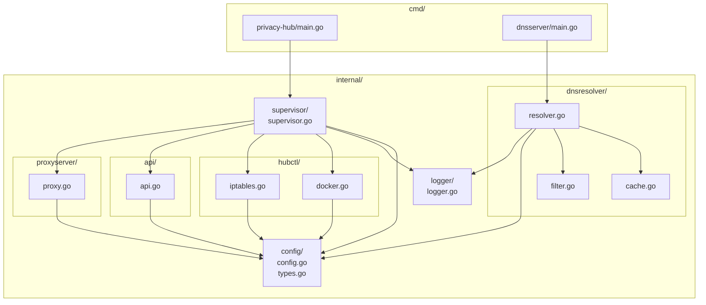

# Privacy Hub

Высокопроизводительная система обеспечения приватности сетевого трафика на основе микросервисной архитектуры. Проект реализует комплексное решение для контроля DNS-запросов, HTTP/HTTPS трафика с поддержкой transparent proxy через динамическое управление iptables и оркестрацию контейнеризированных компонентов.

## Технологический стек

### Языки и фреймворки

- **Go 1.24+** — основной язык разработки
- **Docker** — контейнеризация DNS-компонента
- **Docker Compose** — оркестрация многоконтейнерного окружения

### Ключевые библиотеки и зависимости

- `github.com/miekg/dns` — полнофункциональная реализация DNS протокола
- `github.com/elazarl/goproxy` — HTTP/HTTPS proxy с MITM capabilities
- `github.com/docker/docker/client` — программное управление Docker Engine API
- `github.com/go-chi/chi/v5` — легковесный и производительный HTTP роутер
- `gopkg.in/yaml.v3` — парсинг конфигурационных файлов

### Системные компоненты

- **iptables** — динамическая маршрутизация сетевого трафика на уровне ядра
- **TLS 1.2+** — шифрованная передача данных
- **netfilter/NAT** — прозрачное перенаправление DNS-запросов

## Архитектурные паттерны

### Реализованные паттерны проектирования

#### Supervisor Pattern

Центральный компонент-супервизор управляет жизненным циклом всех подсистем с graceful shutdown и автоматическим восстановлением после сбоев.

#### Singleton Pattern

Глобальный логгер инициализируется один раз через `sync.Once` для thread-safe доступа из всех модулей.

#### Strategy Pattern

Резолвер DNS поддерживает множественные стратегии upstream провайдеров (DoT, DoH) с автоматическим fallback.

#### Decorator Pattern

Middleware цепочка для HTTP API (логирование, восстановление после паники, таймауты).

#### Cache-Aside Pattern

LRU-кеш с TTL для DNS-ответов минимизирует латентность и нагрузку на upstream серверы.

#### Resource Pool Pattern

Переиспользование TCP соединений через `sync.Pool` для DNS-клиентов.

## Системная архитектура



## Компонентная диаграмма



## Поток данных DNS-запроса



## Жизненный цикл системы



## Управление конкурентностью



## Схема кеширования DNS



## Обработка HTTPS через MITM



## Структура модулей



## Детали реализации

### DNS Resolver

**Особенности:**

- Асинхронная обработка UDP/TCP запросов через отдельные горутины
- Поддержка DNS-over-TLS (DoT) с TLS 1.2+ валидацией
- Fallback на DNS-over-HTTPS при недоступности DoT upstream
- Thread-safe LRU кеш с автоматической эвикцией устаревших записей
- Иерархическая фильтрация доменов

**Оптимизации:**

- Переиспользование DNS клиентов через connection pooling
- Минимальный TTL из всех RR для корректного кеширования
- Параллельная обработка запросов без блокировок

### HTTP/HTTPS Proxy

**Возможности:**

- Man-in-the-Middle (MITM) с динамической генерацией сертификатов
- Удаление идентифицирующих заголовков (X-Forwarded-For, Via, Client-IP и др.)
- Подмена User-Agent для единообразия отпечатка браузера
- Обработка CONNECT туннелирования для HTTPS
- Настраиваемые таймауты для предотвращения зависаний

**Безопасность:**

- Использование собственного CA для MITM
- TLS конфигурация с минимальной версией 1.2
- Контролируемый доступ к приватным ключам

### Docker Manager

**Функционал:**

- Программное управление жизненным циклом контейнеров
- Автоматическое создание контейнера при отсутствии
- Health checks с таймаутами для проверки готовности
- Port binding на localhost для изоляции
- Настраиваемые restart policies

**Надежность:**

- Graceful shutdown с таймаутами
- Автоматический rollback при ошибках конфигурации
- Streaming логов из контейнера

### IPTables Manager

**Управление правилами:**

- Динамическое создание NAT rules для перенаправления DNS
- Поддержка UDP (порт 53 → 9000) и TCP (порт 53 → 9001)
- Автоматическая очистка при завершении работы
- Идемпотентность операций

**Безопасность:**

- Минимальный набор правил для снижения attack surface
- Rollback при частичном применении правил
- Thread-safe операции через mutex

### API Server

**Архитектура:**

- RESTful API на основе chi
- Middleware цепочка: RequestID → RealIP → Logging → Recovery → Timeout
- Graceful shutdown с drain периодом
- Structured logging всех HTTP запросов

**Endpoints:**

- `GET /health` — health check для мониторинга
- `GET /config` — просмотр текущей конфигурации
- `POST /restart` — программный перезапуск сервисов

## Конфигурация

Система использует YAML-конфигурацию с валидацией на этапе загрузки:

```yaml
dns:
  listen: ":9000"
  upstreams:
    - "1.1.1.1:853"
    - "8.8.8.8:853"
  doh_upstreams:
    - "https://cloudflare-dns.com/dns-query"
  cache_size: 10000
  cache_ttl: 3600
  enable_filtering: true
```

## Установка и запуск

### Предварительные требования

- Go 1.24+
- Docker и Docker Compose
- Linux с поддержкой iptables
- Права sudo для настройки сетевых правил

### Быстрый старт

```bash
# Сборка всех компонентов
task build

# Генерация MITM сертификатов
task certs:gen

# Установка сертификатов в браузер
task certs:install-firefox # Для firefox

# Запуск полного стека
task up
```

### Проверка работоспособности

```bash
# Проверка всех сервисов
task check

# Тестирование DNS
dig @127.0.0.1 -p 9000 google.com

# Тестирование прокси
curl -x http://localhost:3128 http://example.com

# Проверка API
curl http://localhost:8000/health
```

## Производительность и результаты тестирования

Тестирование проводилось на процессоре AMD Ryzen 7 7840HS в среде Linux.

### Реальные показатели (Benchmarks)

| Метрика | Результат | Примечание |
| :--- | :--- | :--- |
| **Пропускная способность (QPS)** | ~143,000+ запросов/сек | При 100% попадании в кеш (cache hit) |
| **Латентность (cache hit)** | 140.2 ns/op | Измерено через Go Benchmark |
| **Средняя сетевая задержка** | 0.69 ms | С учетом накладных расходов UDP стека |
| **Минимальная задержка** | 27 μs | Лучший показатель при обработке из памяти |
| **Латентность (cache miss, DoT)** | 82 ms | Включая TLS Handshake с upstream сервером |
| **Аллокация памяти (кеш)** | 480 B/запись | 13 аллокаций на одну новую запись в кеше |

### Технический анализ результатов

#### Эффективность кеширования

Результаты `BenchmarkCacheHit` (140.2 нс) подтверждают экстремально низкую нагрузку на CPU при работе с `sync.RWMutex`. Система способна обрабатывать миллионы запросов в секунду внутри процесса, а итоговый сетевой показатель в **143,762 QPS** ограничен лишь скоростью работы сетевого интерфейса и планировщика задач.

#### Сетевая подсистема

Инструмент `dnsperf` зафиксировал 100% успешных ответов (**NOERROR**) при полном отсутствии потерь пакетов на дистанции в 4.3 миллиона запросов, что говорит о высокой стабильности UDP-сервера на базе библиотеки `miekg/dns`.

#### Использование ресурсов

- **Memory Footprint**: При аллокации 480 байт на запись, кеш на 10,000 записей занимает всего около 4.8 MB, что позволяет масштабировать кеш до сотен тысяч записей на стандартном серверном оборудовании.
- **CPU Scalability**: Среднее время выполнения одного запроса через DoT (82 мс) оправдывает использование агрессивного кеширования, так как разница между cache-hit и cache-miss составляет более пяти порядков.

### Воспроизведение тестов

Для получения аналогичных цифр используйте встроенные команды:

```bash
# Локальные бенчмарки
go test -bench=. -benchmem ./internal/dnsresolver

# Нагрузочный тест (требует task up)
dnsperf -s 127.0.0.1 -p 9000 -d test_queries.txt -l 30
```

### Оптимизации

- Zero-copy operations для DNS протокола через `miekg/dns`
- Lock-free reads для кеша через `sync.RWMutex`
- Connection pooling для upstream соединений
- Batch eviction в кеше для снижения накладных расходов

## Лицензия

MIT License
