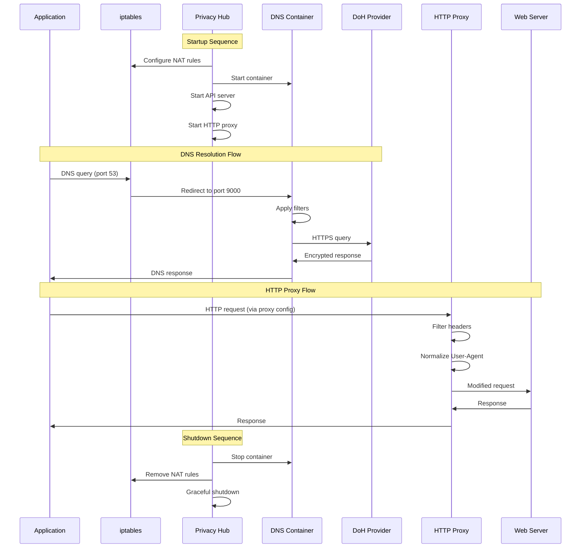
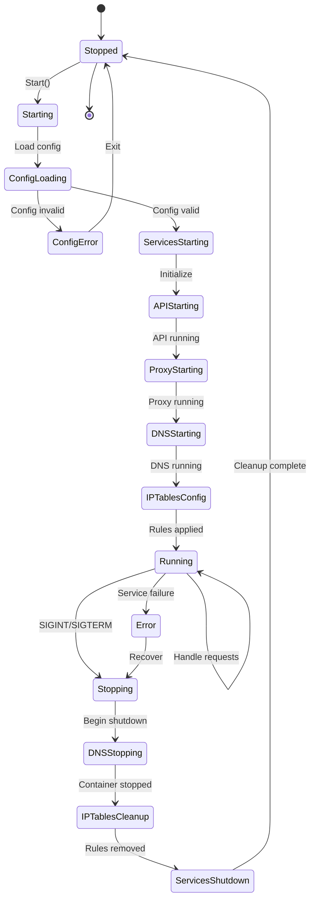

# Privacy Hub

Локальный сервис приватности корпоративного уровня, обеспечивающий фильтрацию DNS, возможности HTTP-прокси и управление трафиком через контейнеризованное DNS-разрешение и манипуляцию трафиком на уровне хоста.

## Содержание

- [Обзор](#обзор)
- [Архитектура](#архитектура)
- [Стек технологий](#стек-технологий)
- [Системные требования](#системные-требования)
- [Установка](#установка)
- [Конфигурация](#конфигурация)
- [Использование](#использование)
- [Справочник API](#справочник-api)
- [Разработка](#разработка)
- [Устранение неполадок](#устранение-неполадок)

---

## Обзор

Privacy Hub - это двухкомпонентное решение для приватности, разработанное для обеспечения полного контроля над DNS и HTTP трафиком на системном уровне. Архитектура разделяет DNS-разрешение в изолированный Docker-контейнер, сохраняя при этом управление на уровне хоста через утилиту управления.

### Ключевые возможности

- **Изолированное DNS-разрешение**: DNS-запросы обрабатываются в контейнеризованной среде
- **DNS-over-HTTPS (DoH)**: Зашифрованные upstream DNS-запросы к Cloudflare/Google
- **HTTP/HTTPS Прокси**: Прозрачный прокси с манипуляцией заголовков
- **Интеграция с iptables**: Автоматическое перенаправление трафика на уровне ядра
- **REST API**: Полное программное управление и мониторинг
- **Фильтрация доменов**: Поддержка черных/белых списков
- **Заголовки приватности**: Автоматическое удаление отслеживающих заголовков
- **Нормализация User-Agent**: Снижает снятие отпечатков браузера
- **Корректное завершение**: Правильная очистка правил iptables и сервисов

---

## Архитектура

### Высокоуровневая системная архитектура

```
┌──────────────────────────────────────────────────────────────────┐
│                         Host System                              │
│                                                                  │
│  ┌─────────────────┐            ┌──────────────────────────────┐ │
│  │  Applications   │            │    Privacy Hub Process       │ │
│  │                 │            │                              │ │
│  │  - Browser      │            │  ┌─────────────────────────┐ │ │
│  │  - CLI tools    │            │  │   Supervisor            │ │ │
│  │  - Services     │            │  │  - Lifecycle Mgmt       │ │ │
│  └────────┬────────┘            │  │  - Error Handling       │ │ │
│           │                     │  └───────────┬─────────────┘ │ │
│           │ DNS (port 53)       │              │               │ │
│           │ HTTP (port 80/443)  │              ├───────────────┤ │
│           │                     │  ┌───────────▼─────────────┐ │ │
│           │                     │  │   API Server (:8000)    │ │ │
│           │                     │  │  - Health checks        │ │ │
│           │                     │  │  - Config management    │ │ │
│           │                     │  │  - Container control    │ │ │
│           │                     │  └───────────┬─────────────┘ │ │
│           │                     │              │               │ │
│           │                     │  ┌───────────▼─────────────┐ │ │
│           │                     │  │   HTTP Proxy (:3128)    │ │ │
│           │                     │  │  - Header filtering     │ │ │
│           │                     │  │  - UA normalization     │ │ │
│           │                     │  │  - Request logging      │ │ │
│           │                     │  └─────────────────────────┘ │ │
│           │                     │              │               │ │
│           │                     │  ┌───────────▼─────────────┐ │ │
│           │                     │  │   hubctl (DNS Control)  │ │ │
│           │                     │  │  - iptables management  │ │ │
│           │                     │  │  - Container lifecycle  │ │ │
│           │                     │  │  - Signal handling      │ │ │
│           │                     │  └───────────┬─────────────┘ │ │
│           │                     └──────────────┼───────────────┘ │
│           │                                    │                 │
│           │                                    │ Docker API      │
│           │                                    │                 │
│  ┌────────▼────────┐                  ┌────────▼──────────────┐  │
│  │   iptables      │                  │   Docker Engine       │  │
│  │                 │                  │                       │  │
│  │  NAT PREROUTING │                  │  ┌─────────────────┐  │  │
│  │  NAT OUTPUT     │                  │  │  DNS Container  │  │  │
│  │                 │                  │  │  (privacy-hub)  │  │  │
│  │  UDP 53 → 9000  │◄─────────────────┼──┤                 │  │  │
│  │  TCP 53 → 9001  │                  │  │  Port 9000/udp  │  │  │
│  └─────────────────┘                  │  │  Port 9001/tcp  │  │  │
│                                       │  │                 │  │  │
└───────────────────────────────────────┼──┤  DNS Resolver   │  │  │
                                        │  │  - Query parse  │  │  │
                                        │  │  - Filtering    │  │  │
                                        │  │  - DoH upstream │  │  │
                                        │  └────────┬────────┘  │  │
                                        │           │           │  │
                                        └───────────┼───────────┘  │
                                                    │              │
                                                    │ HTTPS        │
                                                    │              │
                     ┌──────────────────────────────▼──────────────▼─┐
                     │              Internet                         │
                     │                                               │
                     │  ┌──────────────────┐  ┌──────────────────┐   │
                     │  │ Cloudflare DoH   │  │  Google DoH      │   │
                     │  │ 1.1.1.1          │  │  8.8.8.8         │   │
                     │  └──────────────────┘  └──────────────────┘   │
                     │                                               │
                     └───────────────────────────────────────────────┘
```

### Диаграмма взаимодействия компонентов



### Диаграмма состояний



### Архитектура потоков данных

```
┌─────────────────────────────────────────────────────────────┐
│                    Поток DNS-запросов                       │
└─────────────────────────────────────────────────────────────┘

Приложение
    │
    │ 1. DNS-запрос (example.com A?)
    ▼
iptables (OUTPUT chain)
    │
    │ 2. Совпадение: dport 53, перенаправление на 9000
    ▼
DNS-контейнер (порт 9000)
    │
    │ 3. Разбор запроса
    ▼
Фильтр доменов
    │
    ├─► Совпадение в черном списке? → Вернуть NXDOMAIN
    │
    ├─► Попадание в кеш? → Вернуть кешированный ответ
    │
    └─► Промах в кеше ↓
         │
         │ 4. Построение DoH-запроса
         ▼
    DoH Upstream (Cloudflare/Google)
         │
         │ 5. HTTPS POST /dns-query
         ▼
    DNS-ответ (зашифрованный)
         │
         │ 6. Расшифровка, разбор
         ▼
    Кеширование + возврат приложению
         │
         ▼
Приложение получает IP-адрес


┌─────────────────────────────────────────────────────────────┐
│                     Поток HTTP-прокси                       │
└─────────────────────────────────────────────────────────────┘

Браузер (настроен с прокси :3128)
    │
    │ 1. HTTP CONNECT example.com:443
    ▼
Privacy Hub Proxy
    │
    │ 2. Установка туннеля
    ▼
Фильтр заголовков
    │
    ├─► Удалить: X-Forwarded-For
    ├─► Удалить: Via
    ├─► Удалить: Client-IP
    └─► Удалить: отслеживающие заголовки
         │
         ▼
    Нормализация User-Agent
         │
         │ 3. Установить UA: Privacy-Browser/1.0
         ▼
    Логирование запроса (опционально)
         │
         ▼
Целевой веб-сервер
    │
    │ 4. Ответ
    ▼
Прокси (пропускает)
    │
    ▼
Браузер получает ответ
```

---

## Стек технологий

### Основные зависимости

| Компонент | Технология | Версия | Назначение |
|-----------|-----------|---------|---------|
| Среда выполнения | Go | 1.22+ | Основной язык программирования |
| DNS-сервер | miekg/dns | latest | Реализация DNS-протокола |
| HTTP-роутер | go-chi/chi | v5 | Маршрутизация REST API |
| HTTP-прокси | elazarl/goproxy | latest | HTTP/HTTPS прокси |
| Конфигурация | gopkg.in/yaml.v3 | v3 | Разбор YAML-конфигурации |
| Контейнеризация | Docker | 20.10+ | Изоляция DNS-сервера |
| Управление трафиком | iptables | 1.8+ | Перенаправление пакетов на уровне ядра |

### Системная архитектура

- **Модель параллелизма**: На основе горутин с отменой через контекст
- **IPC**: Каналы для межкомпонентного взаимодействия
- **Управление состоянием**: Разделяемое состояние, защищенное мьютексами
- **Обработка ошибок**: Централизованное логирование ошибок с контекстом
- **Завершение работы**: Корректное завершение с синхронизацией через WaitGroup

---


### Требования к файрволу

```bash
# Разрешить исходящий DoH
iptables -A OUTPUT -p tcp --dport 443 -j ACCEPT

# Разрешить коммуникацию с DNS-контейнером
iptables -A INPUT -i docker0 -p udp --dport 9000 -j ACCEPT
iptables -A INPUT -i docker0 -p tcp --dport 9001 -j ACCEPT
```

---

## Установка

### Быстрый старт

```bash
# Клонировать репозиторий
git clone https://github.com/Roman-Samoilenko/privacy-hub.git
cd privacy-hub

# Собрать DNS-контейнер
docker-compose build

# Собрать утилиту для хоста
go build -o privacy-hub ./cmd/privacy-hub

# Запустить (требуется root для iptables)
sudo ./privacy-hub
```

### Настройка для разработки

```bash
# Установить зависимости
go mod download

# Запустить тесты
go test ./...

# Сборка с отладочными символами
go build -gcflags="all=-N -l" -o privacy-hub-debug ./cmd/privacy-hub

# Запуск с детектором гонок
go run -race ./cmd/privacy-hub
```

### Systemd-сервис

Создать `/etc/systemd/system/privacy-hub.service`:

```ini
[Unit]
Description=Privacy Hub Service
After=network.target docker.service
Requires=docker.service

[Service]
Type=simple
User=root
WorkingDirectory=/opt/privacy-hub
ExecStart=/opt/privacy-hub/privacy-hub
Restart=on-failure
RestartSec=10
KillMode=process

[Install]
WantedBy=multi-user.target
```

Включить и запустить:

```bash
sudo systemctl daemon-reload
sudo systemctl enable privacy-hub
sudo systemctl start privacy-hub
```

---

## Конфигурация

### Основной конфигурационный файл

Расположение: `configs/config.yaml`

```yaml
# Конфигурация DNS-сервера
dns:
  listen: ":8853"
  upstreams:
    - "https://cloudflare-dns.com/dns-query"
    - "https://dns.google/dns-query"
  timeout: 5s
  cache_size: 10000
  cache_ttl: 3600

# Конфигурация HTTP/HTTPS прокси
proxy:
  listen: ":3128"
  filter_headers: true
  user_agent: "Privacy-Browser/1.0 privacy-hub"
  filter_list_headers:
    - "X-Forwarded-For"
    - "Via"
    - "Forwarded"
    - "Client-IP"
    - "True-Client-IP"
    - "X-Real-IP"
    - "X-Client-IP"
    - "X-Forwarded"
    - "Proxy-Connection"
    - "WL-Proxy-Client-IP"
    - "HTTP_CLIENT_IP"
    - "HTTP_X_FORWARDED_FOR"
  mitm_enabled: false  # Требуется CA-сертификат

# Конфигурация REST API
api:
  listen: ":8000"
  cors_enabled: false
  rate_limit: 100  # запросов в минуту

# Конфигурация Docker-контейнера
docker_container:
  name: "privacy-hub-dns"
  listen: 9000
  network: "bridge"
  restart_policy: "unless-stopped"
```

### Переменные окружения

```bash
# Переопределить расположение конфигурационного файла
export PRIVACY_HUB_CONFIG=/path/to/config.yaml

# Установить уровень логирования
export PRIVACY_HUB_LOG_LEVEL=debug  # debug|info|warn|error

# Docker-сокет
export DOCKER_HOST=unix:///var/run/docker.sock
```

---

## Использование

### Запуск сервиса

```bash
# На переднем плане (с логами)
sudo ./privacy-hub

# В фоновом режиме
sudo ./privacy-hub &

# С пользовательской конфигурацией
sudo ./privacy-hub --config=/path/to/config.yaml
```

### Конфигурация системы

Настроить приложения для использования прокси:

```bash
# Переменные окружения
export http_proxy=http://localhost:3128
export https_proxy=http://localhost:3128

# Git
git config --global http.proxy http://localhost:3128

# npm
npm config set proxy http://localhost:3128
npm config set https-proxy http://localhost:3128

# curl
curl -x http://localhost:3128 https://example.com
```

### Проверка

```bash
# Тест DNS-разрешения
dig @127.0.0.1 -p 9000 example.com

# Тест прокси
curl -x http://localhost:3128 -I https://example.com

# Проверка здоровья API
curl http://localhost:8000/health
```

---

## Справочник API

### Проверка здоровья

```http
GET /health
```

**Ответ:**
```
200 OK
Body: "OK"
```

### Статус конфигурации

```http
GET /config
```

**Ответ:**
```json
{
  "dns": {
    "listen": ":8853",
    "upstreams": ["https://cloudflare-dns.com/dns-query"]
  },
  "proxy": {
    "listen": ":3128"
  }
}
```

### Готовность контейнера

```http
POST /ready
Content-Type: application/json

{
  "ready": true
}
```

**Ответ:**
```
200 OK
Body: "The container is ready"
```

Запускает перенаправление DNS-трафика через iptables.

### Перезапуск сервиса

```http
POST /restart
```

**Ответ:**
```
200 OK
Body: "Service is restarting"
```

Инициирует корректный перезапуск всех компонентов.

---

## Разработка

### Структура проекта

```
privacy-hub/
├── cmd/
│   ├── dnsserver/          # Точка входа DNS-контейнера
│   │   └── main.go
│   └── privacy-hub/        # Точка входа утилиты для хоста
│       └── main.go
├── internal/
│   ├── api/                # REST API сервер
│   │   ├── handlers.go
│   │   └── router.go
│   ├── config/             # Загрузка конфигурации
│   │   └── config.go
│   ├── dnsresolver/        # Логика DNS-разрешения
│   │   ├── resolver.go
│   │   ├── cache.go
│   │   └── filter.go
│   ├── hubctl/             # Управление контейнером + iptables
│   │   ├── docker.go
│   │   └── iptables.go
│   ├── logger/             # Структурированное логирование
│   │   └── logger.go
│   ├── proxyserver/        # Реализация HTTP-прокси
│   │   ├── proxy.go
│   │   └── filters.go
│   └── supervisor/         # Управление жизненным циклом сервисов
│       └── supervisor.go
├── configs/
│   └── config.yaml
├── docker-compose.yml
├── Dockerfile.DNS
├── go.mod
├── go.sum
└── README.md
```

### Добавление новых функций

1. **Новый DNS-фильтр**: Реализовать в `internal/dnsresolver/filter.go`
2. **Новый обработчик прокси**: Добавить в `internal/proxyserver/filters.go`
3. **Новая конечная точка API**: Зарегистрировать в `internal/api/router.go`
4. **Опция конфигурации**: Обновить `internal/config/config.go` и `config.yaml`

### Тестирование

```bash
# Модульные тесты
go test ./internal/...

# Интеграционные тесты
go test -tags=integration ./...

# Бенчмарки
go test -bench=. ./internal/dnsresolver

# Покрытие
go test -coverprofile=coverage.out ./...
go tool cover -html=coverage.out
```

---

## Устранение неполадок

### Распространенные проблемы

#### Порт уже используется

```bash
# Найти процесс, использующий порт
sudo lsof -i :8000
sudo lsof -i :3128
sudo lsof -i :9000

# Убить процесс
sudo kill -9 <PID>

# Или убить все экземпляры
sudo pkill -9 privacy-hub
```

#### Правила iptables не применены

```bash
# Проверить таблицу NAT
sudo iptables -t nat -L -n -v

# Применить правила вручную (для отладки)
sudo iptables -t nat -A OUTPUT -p udp --dport 53 -j REDIRECT --to-port 9000

# Очистить все правила (ОСТОРОЖНО: может нарушить подключение)
sudo iptables -t nat -F
```

#### DNS-контейнер не запускается

```bash
# Проверить логи Docker
docker logs privacy-hub-dns

# Проверить статус контейнера
docker ps -a | grep privacy-hub

# Пересобрать контейнер
docker-compose down
docker-compose build --no-cache
docker-compose up -d
```

#### Ошибки подключения DoH

```bash
# Тест подключения к upstream
curl -v https://cloudflare-dns.com/dns-query

# Проверить DNS-разрешение (в обход)
dig @1.1.1.1 cloudflare-dns.com

# Проверить правила файрвола
sudo iptables -L OUTPUT -v -n | grep 443
```

### Режим отладки

Включить подробное логирование:

```go
// internal/logger/logger.go
func newLogger() *Logger {
    return &Logger{
        log: log.New(os.Stdout, "", log.Ltime|log.Lshortfile|log.Lmicroseconds),
    }
}
```

### Мониторинг производительности

```bash
# Использование ресурсов
docker stats privacy-hub-dns

# Статистика процессов
ps aux | grep privacy-hub

# Сетевая статистика
netstat -tuln | grep -E '8000|3128|9000'
```

---

## Вопросы безопасности

### Модель угроз

- **Man-in-the-Middle**: Шифрование DoH защищает DNS-запросы
- **DNS-спуфинг**: Валидация DNSSEC (если включена в upstream)
- **Утечка заголовков**: Автоматическое удаление отслеживающих заголовков
- **Снятие отпечатков**: Нормализация User-Agent

### Лучшие практики

1. **Файрвол**: Ограничить порт API (8000) на localhost
2. **Обновления**: Регулярно обновлять Docker-образы и Go-зависимости
3. **Логи**: Ротировать и санитизировать логи для предотвращения утечек данных
4. **Сертификаты**: При использовании MITM безопасно хранить приватные ключи CA
5. **Права**: Запускать с минимально необходимыми привилегиями

### Известные ограничения

- Не защищает от обхода DNS-over-TLS (DoT)
- Расширения браузера могут переопределять настройки прокси
- Некоторые приложения жестко кодируют DNS-серверы (например, 8.8.8.8)
- Правила iptables требуют привилегий root


---

# Сетевая статистика
netstat -tuln | grep -E '8000|3128|9000'
```
